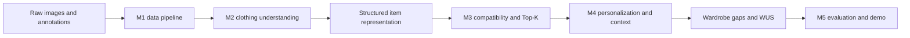

# WARDIQ

WARDIQ is a six-week AI/ML project for clothing understanding, outfit compatibility, personalized recommendation, and wardrobe optimization. This repository is the shared implementation and handoff point for the six-person team.

## Current status

Milestone 1 data foundation is ready for team review. The repository includes a validated 85,815-row image manifest, verified development samples, dataset decisions, and reproducibility scripts. Large source datasets are intentionally excluded.

- **Fashionpedia:** provisionally selected for garment boxes, masks, categories, and attributes.
- **Polyvore Outfits:** selected for compatibility and recommendation using the disjoint split.
- **Fashion-MNIST:** used only for loader and preprocessing checks.
- **DeepFashion-MultiModal:** backup dataset.

Start with [the M1 handoff](docs/milestones/M1-data-handoff.md), [data instructions](data/README.md), and [dataset decisions](docs/decisions/dataset-selection.md).

## System flow



## Quick start

```powershell
python -m pip install -e ".[dev]"
python scripts/validate_repository.py
python -m pytest
```

Run these commands from the repository root using your normal Python interpreter.
No virtual environment or activation is required. Python 3.10+ is declared; local
baseline validation used Python 3.13.15. Other versions and dependency installation
must pass clean-install checks before compatibility is considered verified.

GitHub CI is configured to check Python 3.10, 3.11, and 3.12 on pull requests,
pushes to `main` or `chore/repo-hardening`, and manual runs. See
[CI checks and local commands](docs/CI.md) for scope and current verification limits.

For dataset download and inspection scripts, add the data dependencies:

```powershell
python -m pip install -e ".[data]"
```

Research scripts accept portable input paths; see [reproduction commands](docs/REPRODUCIBILITY.md)
for required raw files and verified checks. Repository validation does not require
raw downloads. Use `python scripts/tasks.py samples` for committed-sample checks.

Install the optional ML stack only when model work begins:

```powershell
python -m pip install -e ".[ml]"
```

## Repository map

| Path | Purpose |
|---|---|
| `configs/` | Versioned dataset, split, and model configuration |
| `data/manifests/` | Traceable image-level inventories committed to Git |
| `data/samples/` | Small verified examples for loader development |
| `data/raw/` | Local source downloads; ignored by Git |
| `data/processed/` | Generated artifacts; ignored by Git |
| `docs/` | Proposal, architecture, decisions, milestones, and ownership |
| `scripts/` | Reproducible download, inspection, and validation commands |
| `src/wardiq/` | Production Python package organized by system module |
| `tests/` | Fast checks for shared contracts and utilities |

## Team ownership

| Member | Primary responsibility |
|---|---|
| Eyad Amir | Data and CV pipeline |
| Hayat Hussein | CV representation and integration |
| Ziad Nasser | Computer vision and models |
| Omar Ahmed | Compatibility and recommendation |
| Hana Emad El Din Shazly | Personalization and optimization |
| Asmaa Tamer | Evaluation, documentation, and integration |

Detailed weekly assignments are in [team ownership](docs/team/OWNERSHIP.md).
Milestone input/output requirements and review evidence are described in the
[handoff checklist](docs/HANDOFFS.md). The current milestone pages describe planned
work and explicit acceptance status; infrastructure checks do not complete team tasks.
See [draft shared types](docs/CONTRACTS.md) and [review routing](docs/team/REVIEWERS.md)
for interface agreement and blocked-dependency coordination.

## Collaboration rules

1. Create a short-lived branch from `main`.
2. Keep raw datasets and generated model weights out of Git.
3. Preserve `item_id`, source dataset, original path or index, annotations, and split metadata.
4. Open a pull request and request review from the downstream owner.
5. Merge only after CI passes and the documented output contract is satisfied.

See [CONTRIBUTING.md](CONTRIBUTING.md) for branch names, commits, reviews, and data rules.

## Project boundary

The core deliverable is a reproducible AI/ML pipeline and evaluation. A full web/mobile application, marketplace integration, LLM assistant, RAG system, and virtual try-on are outside the six-week scope.
