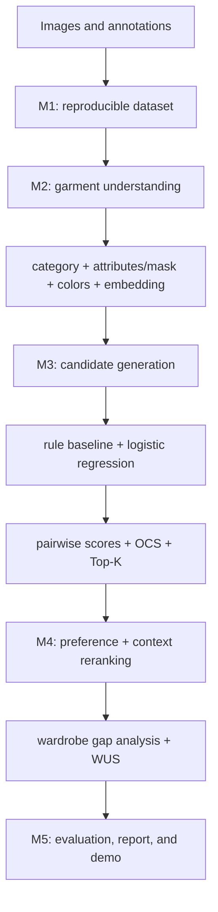

# WARDIQ project proposal

## Objective

WARDIQ will build a reproducible AI/ML pipeline that understands clothing items, scores outfit compatibility, personalizes recommendations, and estimates which wardrobe additions create useful new outfits.

The six-week result is a tested pipeline, documented model decisions, evaluation results, and a clear demonstration. The project does not require a production marketplace or consumer application.

## Architecture

## Milestones

| Period | Milestone | Completion result |
|---|---|---|
| Sep 20-26, 2026 | M1 data foundation | Shared manifest, preprocessing contract, garment preparation, reproducible split, loader verification |
| Sep 27-Oct 3, 2026 | M2 clothing understanding | Frozen structured item representation and versioned M2-to-M3 contract |
| Oct 4-10, 2026 | M3 compatibility | Candidate generation, baselines, pairwise compatibility, OCS, and Top-K ranking |
| Oct 11-17, 2026 | M4 personalization | Preference/context reranking, wardrobe gap analysis, WUS, product-ready structured output |
| Oct 18-31, 2026 | M5 evaluation and delivery | Results, error analysis, reproducible pipeline, report, presentation, and demo |

## Required core

- Complete M1 data pipeline and traceability.
- ResNet-50 category baseline and selected structured clothing representation.
- Attributes with an explicit missing-value mask, garment-region colors, and embeddings.
- Frozen M2-to-M3 schema and leakage-safe compatibility dataset.
- Candidate generation, rule baseline, logistic regression, OCS, and Top-K ranking.
- Preference/context reranking, wardrobe gap analysis, and WUS.
- End-to-end evaluation, report, and demonstration.

## Conditional experiments

Standalone ViT, CLIP pseudo-labeling, deeper fine-tuning, hard-negative refinement, a second compatibility model, MMR, and formal WUS-weight optimization begin only after the core path works.

## Out of scope

A full web/mobile application, marketplace or e-commerce integration, an LLM fashion assistant, RAG, and virtual try-on are outside the six-week AI/ML scope.

## Evaluation and delivery

Evaluate clothing understanding, compatibility classification/ranking, personalization, WUS sensitivity, traceability, leakage, and reproducibility. Every milestone produces a documented handoff contract that downstream work can run without private instructions.
